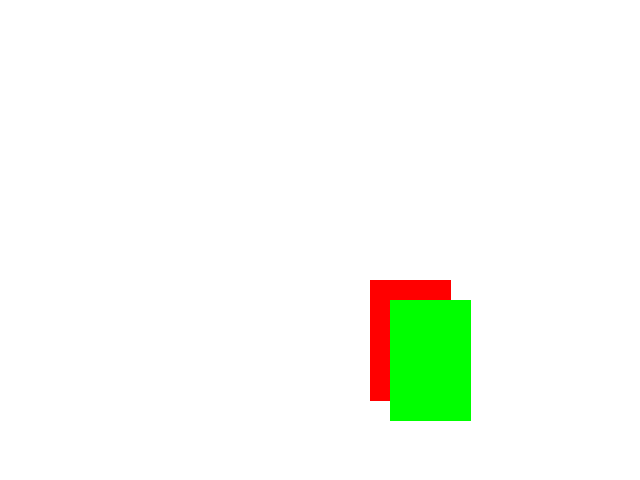

# Drawing++

Drawing++ is C++ library for drawing user-defined shapes using libpng.

## Compiling

Compile Drawing++.cpp with libpng flags (from `libpng-config` or link manually).

g++ example:
```sh
#compile to Drawing++.o
g++ -c Drawing++.cpp `libpng-config --libs --cflags`

#compile example code
g++ Example/Example.cpp Drawing++.o `libpng-config --libs --cflags`
#g++ Example/Example.cpp Drawing++.cpp `libpng-config --libs --cflags`
```

## Usage

```c++
#include <vector>
#include <cassert>
#include "../Drawing++.hpp" //include Drawing++ header file

//user-defined shape function
static int shape_square_filled(const Drawing::Drawable *drawable, double x, double y){
    assert(drawable->points.size() >= 2);
    return x >= drawable->points[0].x && x <= drawable->points[1].x &&
            y >= drawable->points[0].y && y <= drawable->points[1].y;
}


int main(){
    Drawing::Canvas canvas(640, 480); //Create Drawing::Canvas 640x480 size
    
    canvas.addDrawable(Drawing::Drawable(
        new Drawing::Color(1.0, 0.0, 0.0, 1.0),
        shape_square_filled, 0.0,
        std::vector<Drawing::Point>{ 
            Drawing::Point(370, 280), Drawing::Point(450, 400) 
        }
    )); 
    //Add Drawable with RGBA(1.0, 0.0, 0.0, 1.0), with 0 line width and vector of two points.
    //Drawable shape is defined by user function shape_square_filled


    canvas.addDrawable(Drawing::Drawable(
        new Drawing::Color(0.0, 1.0, 0.0, 1.0),
        shape_square_filled, 0.0,
        std::vector<Drawing::Point>{ 
            Drawing::Point(370+20, 280+20), Drawing::Point(450+20, 400+20) 
        }
    )); 

    canvas.draw(); //draw every drawable in canvas to buffer
    canvas.bufferToFile("./output.png"); //output buffer to file "./output.png"
    
    return 0;
}
```

Output of example above:



## License
[MIT](https://choosealicense.com/licenses/mit/)
