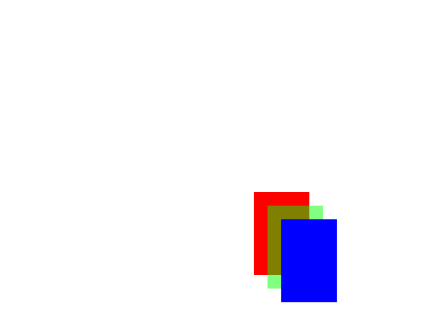
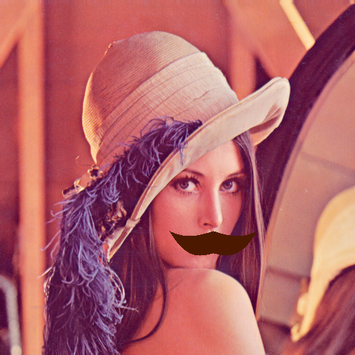

# Drawing++

Drawing++ is C++ library for drawing user-defined shapes using libpng.

## Compiling

Compile Drawing++.cpp with libpng flags (from `libpng-config` or link manually).

g++ example:
```sh
#compile to Drawing++.o
g++ -c Drawing++.cpp `libpng-config --libs --cflags`

#compile example code
g++ Example/Example.cpp Drawing++.o `libpng-config --libs --cflags`
#g++ Example/Example.cpp Drawing++.cpp `libpng-config --libs --cflags`
```

## Basic usage, drawing squares on canvas:
```c++
#include "../../Drawing++.hpp" //include Drawing++ header file

//user-defined draw function
static void filled_rect_func(Drawing::Drawable *drawable, Drawing::Canvas* canvas){
    const Drawing::Color pixel = drawable->getPixel(0, 0);
    canvas->fillputPixels(drawable->points[0].x(), drawable->points[1].x(), 
        drawable->points[0].y(), drawable->points[1].y(), pixel);
}


int main(){
    Drawing::Canvas canvas(640, 480); //Create Drawing::Canvas 640x480 size

    canvas.addDrawable(Drawing::Figure(
        Drawing::Color(1.0, 0.0, 0.0, 1.0),
        filled_rect_func,
        std::vector<Drawing::Point>{ 
            Drawing::Point({370, 280}), Drawing::Point({450, 400}) 
        }
    ));

    canvas.addDrawable(Drawing::Figure(
        Drawing::Color(0.0, 1.0, 0.0, 0.5),
        filled_rect_func,
        std::vector<Drawing::Point>{ 
            Drawing::Point({370+20, 280+20}), Drawing::Point({450+20, 400+20}) 
        }
    ));

    canvas.addDrawable(Drawing::Figure(
        Drawing::Color(0.0, 0.0, 1.0, 1.0),
        filled_rect_func,
        std::vector<Drawing::Point>{ 
            Drawing::Point({370+40, 280+40}), Drawing::Point({450+40, 400+40}) 
        }
    )); 

    canvas.draw(); //draw every drawable in canvas to buffer
    canvas.bufferToFile("./output.png"); //output buffer to file "./output.png"

    return 0;
}
```
`Output image:`



---

## Loading image to canvas:
```c++
#include "../../Drawing++.hpp"

static void mustache_draw_func(Drawing::Drawable *drawable, Drawing::Canvas* canvas){
    //whole function in ./Examples/LoadPNG/LoadPNG.cpp
}

int main(){
    Drawing::Canvas canvas(512, 512);
    
    canvas.addDrawable(Drawing::ImageFile("./Lenna_(test_image).png"));
    //Create imageFile and add to canvas
    //const char* filepath is file path to PNG image file
    
    canvas.addDrawable(Drawing::Figure(
        Drawing::Color(0.3, 0.1, 0.0, 1.0), mustache_draw_func,
        std::vector<Drawing::Point>{ 
            Drawing::Point({512, 512}), Drawing::Point({0.25}), 
            Drawing::Point({0.6, 0.65}) 
        }
    )); //Use mustache draw func!

    canvas.draw();
    canvas.bufferToFile("./mustachegirl.png");
    return 0;
}
```
`Output image:`



## License
[MIT](https://choosealicense.com/licenses/mit/)
